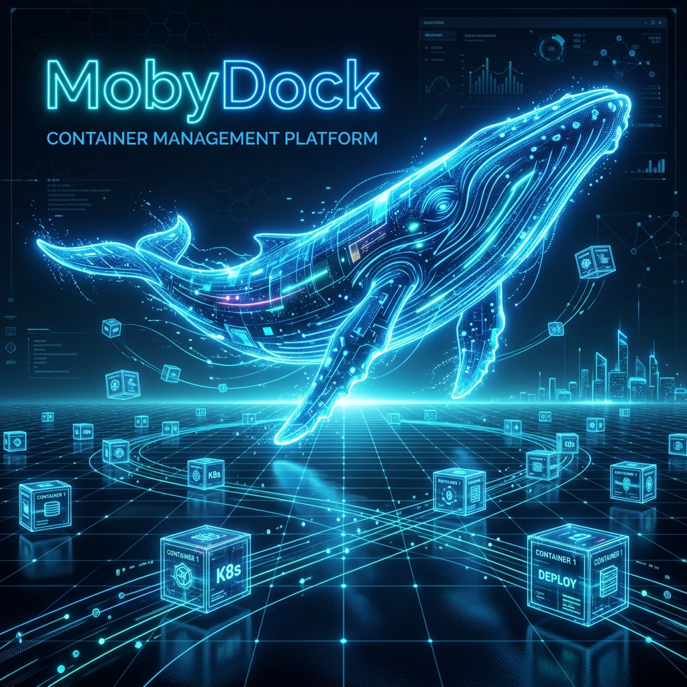

# 🐳 MobyDock v2.4.0

> **Enterprise Docker & Podman Management — 5-Container Microservices Architecture, Traefik v3 API Gateway, Live Process Manager (htop), Self-Healing Watchdog Engine, Container QA Workbench, Resource Telemetry, Live Permissions Manager, Compose Builder, and Spec Exporters**




**MobyDock** is a modern, glassmorphic web application for managing Docker and Podman environments. Built for enterprise platforms and air-gapped environments (such as Red Hat Enterprise Linux 9). Features a **5-Container Microservices Architecture** orchestrated via `docker-compose.yml` with a **Traefik v3 API Gateway**, an interactive **Live Process Manager (`htop`)**, and an automated **Self-Healing Watchdog Engine**.

---

## ✨ Key Features (v2.4.0)

### 💻 Live Container Process Manager (`htop` / `top`)
- **Interactive PID Process Table**: Real-time list of all processes running inside any container (`PID`, `USER`, `%CPU`, `%MEM`, `RSS`, `STAT`, `TIME`, `COMMAND`).
- **Live Filter & Auto-Refresh**: Instant process query filtering with 3-second auto-polling loop.
- **1-Click Process Termination (`kill -9`)**: Issue `SIGKILL` or `SIGTERM` directly to any PID inside the container from the Web UI.

### 🛡️ Automated Self-Healing Watchdog Engine
- **Background Anomaly Monitor**: 10-second inspection loop checking container health status, RAM usage spikes, and crash loops.
- **Auto-Restart Recovery**: Automatically recovers containers failing healthchecks (`unhealthy`) or crashing (`exited` non-zero).
- **RAM Spike Protection**: Detects memory usage exceeding 95% threshold and logs automated protection alerts.
- **CrashLoopBackOff Protection**: Guards against infinite restart loops by isolating containers restarting >5 times in 2 minutes.
- **Persistent Recovery Stream**: Audit event log stored in `/app/data/store.json` and streamed live to the UI.

### 🚦 Traefik v3 API Gateway & Visual Dashboard
- **Modern API Gateway (`mobydock-gateway`)**: Traefik v3 entrypoint on port `9090`.
- **Traefik Visual Dashboard (Port `8080`)**: Interactive web dashboard at `http://localhost:8080/dashboard/`.
- **Air-Gap Ready Dynamic File Provider (`traefik_dynamic.yml`)**: 100% offline air-gap routing table.

### 🛠️ Container QA Workbench & Real-Time Telemetry
- **Quality Scorecard & Rating (0-100, Grade A-F)**: Automated security, memory, CPU, healthcheck, user, and restart policy evaluation.
- **1-Click Live Fixes**: Dynamically apply memory limits, CPU limits, and restart policies to running containers without recreation.
- **Real-Time Telemetry Curves**: 3-second auto-polling SVG charts for RAM, CPU load %, and Disk Storage.

### 📁 Live Container File Explorer & Permissions Manager
- **Colorized Perms & Warning Badges**: Red warning badges (`⚠️ 777`), green exec badges (`⚡`), amber config badges (`🔒`).
- **Live `chmod` & `chown` Controls**: Per-row permission and ownership changes inside running containers.
- **Live Path Autocomplete & Base64 Editor**: Tab/click autocomplete and UTF-8 base64 file editor.

### 🎨 Visual Drag-and-Drop Compose Builder
- Interactive microservices canvas with draggable service nodes and Bezier curve links.
- Quick preset stacks (PostgreSQL, Oracle Server, Oracle Client) and offline `.tar.gz` image load.

---

## 🏛️ Microservices & API Gateway Diagram

```
                             Browser (Client)
                                    │
                       HTTP / WS  Port 9090
                                    ▼
┌─────────────────────────────────────────────────────────────────┐
│                 mobydock-gateway (Traefik v3)                   │
│        Web Entrypoint: Port 9090 | Dashboard: Port 8080        │
└──────┬───────────────┬──────────────────┬─────────────────┬─────┘
       │               │                  │                 │
       │ /*, /api/*    │ /api/qa/*        │ /api/files/*    │ /socket.io/*
       ▼               ▼                  ▼                 ▼
┌──────────────┐┌──────────────┐   ┌──────────────┐  ┌──────────────────┐
│mobydock-core ││  mobydock-qa │   │mobydock-files│  │mobydock-terminal │
│ (Port 3001)  ││ (Port 3002)  │   │ (Port 3003)  │  │   (Port 3004)    │
└──────┬───────┘└──────┬───────┘   └──────┬───────┘  └────────┬─────────┘
       │               │                  │                   │
       └───────────────┼──────────────────┴───────────────────┘
                       ▼
         ┌──────────────────────────┐
         │ backend/lib/watchdog.js  │
         │ Self-Healing Engine      │
         │ Persistent JSON Store    │
         │ /app/data/store.json     │
         └─────────────┬────────────┘
                       │ /var/run/docker.sock
                       ▼
         ┌──────────────────────────┐
         │ Host Docker / Podman     │
         │ (RHEL 9 / Linux / macOS) │
         └──────────────────────────┘
```

---

## 🚀 Quickstart

```bash
# Clone repository
git clone https://github.com/CostaEp/docker-tools.git
cd docker-tools

# Build and start MobyDock v2.4.0 microservices stack
docker compose up -d --build
```
- Web Application UI: **`http://localhost:9090`**
- Traefik API Gateway Dashboard: **`http://localhost:8080/dashboard/`**

---

## 📄 License

Distributed under the **MIT License**. Created & maintained by **Costa Epshtein** & **Antigravity AI (Google DeepMind)**.
